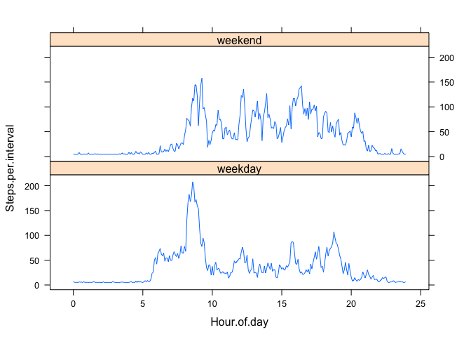

# Reproducible Research: Peer Assessment 1
David Seibel  
January 16, 2015  
 

## Loading and preprocessing the data

Download the data file.  

```r
setwd("~/Desktop/Online-Classes/Johns Hopkins Data Science/Reproducable Research/RepData_PeerAssessment1")
zipURL<-"https://d396qusza40orc.cloudfront.net/repdata%2Fdata%2Factivity.zip"
zipFile<- download.file(zipURL, dest="myactivity.zip",method="curl")
```

Read and examine the data.

```r
clean<-read.csv(unz("myactivity.zip","activity.csv"),colClasses=c("integer","Date","integer")) #nrows=5
str(clean)
```

```
## 'data.frame':	17568 obs. of  3 variables:
##  $ steps   : int  NA NA NA NA NA NA NA NA NA NA ...
##  $ date    : Date, format: "2012-10-01" "2012-10-01" ...
##  $ interval: int  0 5 10 15 20 25 30 35 40 45 ...
```

```r
summary(clean)
```

```
##      steps             date               interval     
##  Min.   :  0.00   Min.   :2012-10-01   Min.   :   0.0  
##  1st Qu.:  0.00   1st Qu.:2012-10-16   1st Qu.: 588.8  
##  Median :  0.00   Median :2012-10-31   Median :1177.5  
##  Mean   : 37.38   Mean   :2012-10-31   Mean   :1177.5  
##  3rd Qu.: 12.00   3rd Qu.:2012-11-15   3rd Qu.:1766.2  
##  Max.   :806.00   Max.   :2012-11-30   Max.   :2355.0  
##  NA's   :2304
```

## What is mean of the: (total number of steps taken per day)?

1. Calculate the total number of steps taken per day and display with a histogram:

```r
steps.per.day<-by(clean$steps,clean$date,sum)
hist(steps.per.day)
```

 

2. Report the mean and median of the: (total steps taken per day):

```r
summary(steps.per.day)
```

```
##    Min. 1st Qu.  Median    Mean 3rd Qu.    Max.    NA's 
##      41    8841   10760   10770   13290   21190       8
```

## What is the average daily activity pattern?

Clarification:

    Consider the "steps" for each 5 minute interval across all 61 days of the study.  
    In a 24 hour day, there are 12*24=288 "5 minute" intervals.
    For example, the interval "8:45 am", has 61 measures of steps (one per day).
    Find the average value of those 61 obervations across all days for the "8:45 am" inteval.
    Do the same for each interval.  


Analyze the data, plot, and find the inteval with the highest mean steps.

```r
#summarize data by interval across all days and display head for clarity
interval.means<-aggregate(clean$steps,by=list(clean$interval),mean,na.rm=TRUE)
head(interval.means)
```

```
##   Group.1         x
## 1       0 1.7169811
## 2       5 0.3396226
## 3      10 0.1320755
## 4      15 0.1509434
## 5      20 0.0754717
## 6      25 2.0943396
```

```r
# function to convert interval labels into hours in decimal form, for time series plotting.
hour.from.interval<-function(x) {
 n<-x/100
 floor(n) + ( n-floor(n) )*100/60
}
# create matrix for plotting.
int.means<-cbind(Hour.of.day=hour.from.interval(interval.means$Group.1),Steps.per.interval=(interval.means$x))
# make plot and calculate max interval and steps
plot(int.means,type="l")
```

 

```r
# determine the interval with the highest mean steps (peak of the plot above)
maxone<-interval.means[which.max(interval.means$x),]
names(maxone)<-c("interval","mean")
maxone
```

```
##     interval     mean
## 104      835 206.1698
```
The label of the maximum 5-minute interval is: 835 (format: hhmm).  
It had an average of 206 steps (rounded) per 5 minutes.


## Imputing missing values

Calculate the total number of missing values in the dataset.

```r
missing<-length(clean[,1]) - sum(complete.cases(clean))
```
There were 2304 missing values in the dataset.

Calculate the mean steps per five minute interval across all intervals and all days.  

```r
meansteps<-mean(clean[,1],na.rm=TRUE)
meansteps
```

```
## [1] 37.3826
```

Imput the missing values using the mean above and compare before and after.

```r
compcase<-complete.cases(clean)
new.clean<-data.frame(steps=replace(clean[,1],!compcase,meansteps),clean[,2:3])  
head(clean)
```

```
##   steps       date interval
## 1    NA 2012-10-01        0
## 2    NA 2012-10-01        5
## 3    NA 2012-10-01       10
## 4    NA 2012-10-01       15
## 5    NA 2012-10-01       20
## 6    NA 2012-10-01       25
```

```r
head(new.clean)
```

```
##     steps       date interval
## 1 37.3826 2012-10-01        0
## 2 37.3826 2012-10-01        5
## 3 37.3826 2012-10-01       10
## 4 37.3826 2012-10-01       15
## 5 37.3826 2012-10-01       20
## 6 37.3826 2012-10-01       25
```


1. Using inputed data, make a histogram of the total number of steps taken each day:

```r
new.steps.per.day<-by(new.clean$steps,new.clean$date,sum)
hist(new.steps.per.day)
```

 

2. Using imputed data, report the mean and median of the: (total steps taken per day)

```r
summary(new.steps.per.day)
```

```
##    Min. 1st Qu.  Median    Mean 3rd Qu.    Max. 
##      41    9819   10770   10770   12810   21190
```

The median value for the imputed dataset increased slightly by 10 from 10760 to 10770, the mean was unchanged.

## Are there differences in activity patterns between weekdays and weekends?

Create a variable that indicates weekend (Sat, Sun) versus weekday (Mon-Fri) and display.

```r
new.clean$wkday<-weekdays(new.clean$date,abbreviate = TRUE)
weekpart.f<- function (day) { if (day %in% c("Sat","Sun")) "weekend" else "weekday"   }
new.clean$weekpart<-as.factor(sapply(new.clean$wkday,weekpart.f))
str(new.clean)
```

```
## 'data.frame':	17568 obs. of  5 variables:
##  $ steps   : num  37.4 37.4 37.4 37.4 37.4 ...
##  $ date    : Date, format: "2012-10-01" "2012-10-01" ...
##  $ interval: int  0 5 10 15 20 25 30 35 40 45 ...
##  $ wkday   : chr  "Mon" "Mon" "Mon" "Mon" ...
##  $ weekpart: Factor w/ 2 levels "weekday","weekend": 1 1 1 1 1 1 1 1 1 1 ...
```

```r
head(new.clean)
```

```
##     steps       date interval wkday weekpart
## 1 37.3826 2012-10-01        0   Mon  weekday
## 2 37.3826 2012-10-01        5   Mon  weekday
## 3 37.3826 2012-10-01       10   Mon  weekday
## 4 37.3826 2012-10-01       15   Mon  weekday
## 5 37.3826 2012-10-01       20   Mon  weekday
## 6 37.3826 2012-10-01       25   Mon  weekday
```

```r
head(new.clean[new.clean$weekpart=="weekend",])
```

```
##      steps       date interval wkday weekpart
## 1441     0 2012-10-06        0   Sat  weekend
## 1442     0 2012-10-06        5   Sat  weekend
## 1443     0 2012-10-06       10   Sat  weekend
## 1444     0 2012-10-06       15   Sat  weekend
## 1445     0 2012-10-06       20   Sat  weekend
## 1446     0 2012-10-06       25   Sat  weekend
```

```r
head(new.clean[new.clean$weekpart=="weekday",])
```

```
##     steps       date interval wkday weekpart
## 1 37.3826 2012-10-01        0   Mon  weekday
## 2 37.3826 2012-10-01        5   Mon  weekday
## 3 37.3826 2012-10-01       10   Mon  weekday
## 4 37.3826 2012-10-01       15   Mon  weekday
## 5 37.3826 2012-10-01       20   Mon  weekday
## 6 37.3826 2012-10-01       25   Mon  weekday
```

Analyze the inputed data by interval across all days.

```r
#summarize data by interval across all days and display head for clarity
i.interval.means<-aggregate(new.clean$steps,by=list(new.clean$weekpart,new.clean$interval),mean,na.rm=TRUE)
head(i.interval.means)
```

```
##   Group.1 Group.2        x
## 1 weekday       0 7.006569
## 2 weekend       0 4.672825
## 3 weekday       5 5.384347
## 4 weekend       5 4.672825
## 5 weekday      10 5.139902
## 6 weekend      10 4.672825
```

```r
# function to convert interval labels into hours in decimal form, for time series plotting.
hour.from.interval<-function(x) {
 n<-x/100
 floor(n) + ( n-floor(n) )*100/60
}
# create dataframe for plotting.
i.int.means<-data.frame(Hour.of.day=hour.from.interval(i.interval.means$Group.2),
                   Weekpart=i.interval.means$Group.1,
                   Steps.per.interval=(i.interval.means$x))
head(i.int.means)
```

```
##   Hour.of.day Weekpart Steps.per.interval
## 1  0.00000000  weekday           7.006569
## 2  0.00000000  weekend           4.672825
## 3  0.08333333  weekday           5.384347
## 4  0.08333333  weekend           4.672825
## 5  0.16666667  weekday           5.139902
## 6  0.16666667  weekend           4.672825
```

```r
# make plot with a panel for weekend and for weekday
 library("lattice")
xyplot(Steps.per.interval ~ Hour.of.day | Weekpart, data=i.int.means,type="l",layout=c(1,2))
```

 
